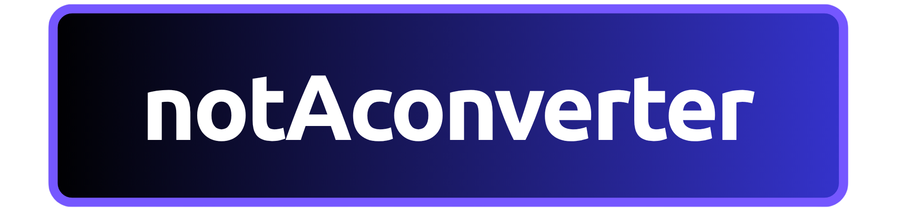
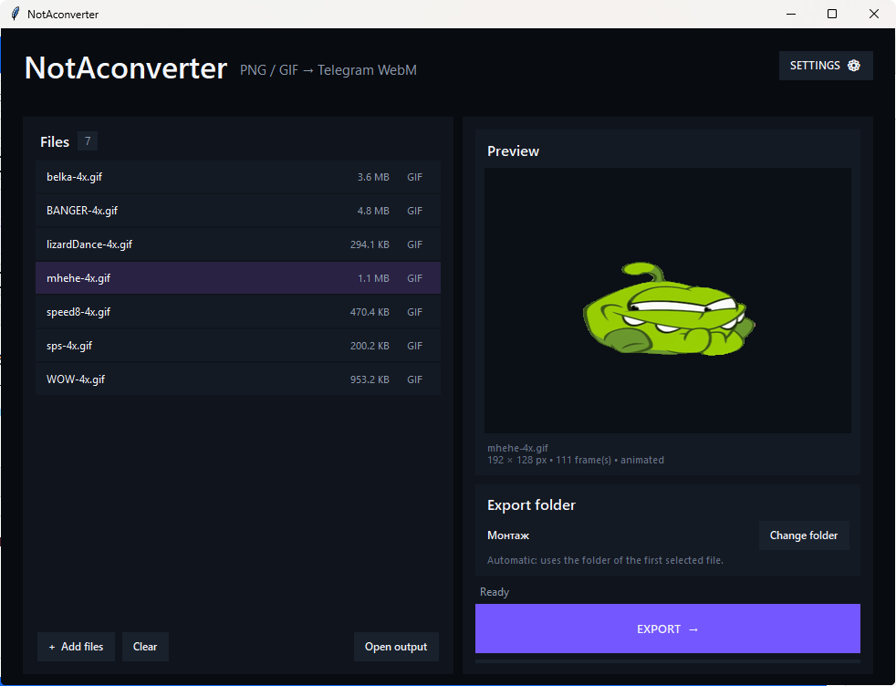
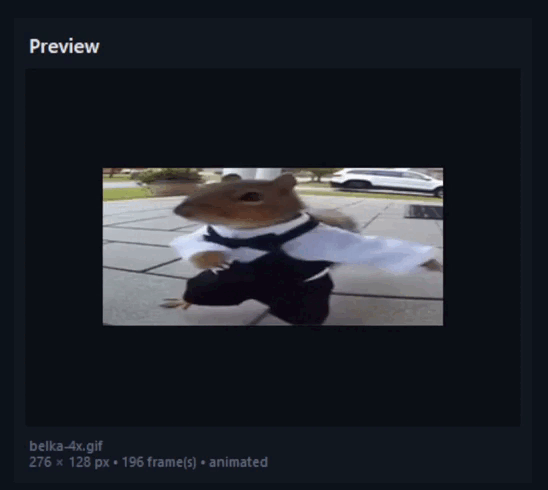
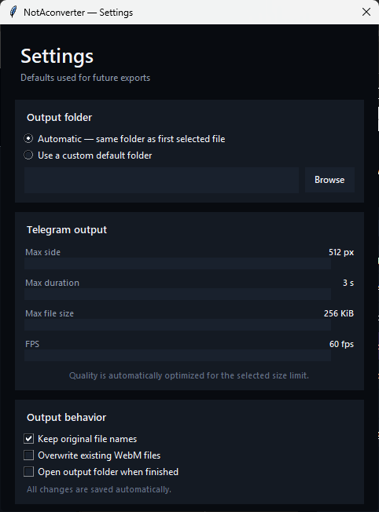

# 🎨 NotAconverter

### PNG / GIF → WebM converter for Telegram animated stickers

<p align="center">
  
</p>

<p align="center">
  <b>Turn your PNGs and GIFs into Telegram-ready animated stickers.</b>
  <br>
  Fast • Simple • Lightweight
</p>

<p align="center">
  <a href="../../releases/latest">
    
  </a>
  &nbsp;
  <a href="../../releases">
    
  </a>
</p>


## ✨ Features

🎞️ **GIF → WebM**
Convert animated GIFs into WebM files for Telegram.

🖼️ **PNG → WebM**
Turn PNG images into WebM with transparency support.

📐 **Telegram-ready output**
Automatically prepares the output for Telegram's sticker format.

⚡ **Automatic optimization**
The converter handles quality and compression automatically.

📦 **Batch conversion**
Convert multiple files at once.

🖱️ **Drag & Drop**
Simply drag your files into the application.

👀 **Animated GIF preview**
Preview your animation before converting it.

📁 **Custom export folder**
Choose exactly where your converted files should be saved.

💾 **Settings persistence**
Your preferences are remembered between launches.

## 🖥️ Preview

### Main interface

<p align="center">
  
</p>

### 🎞️ GIF Preview

<p align="center">
  
</p>

### ⚙️ Settings

<p align="center">
  
</p>


## 🚀 Download

Go to the **[Latest Release](../../releases/latest)** and download the `.exe` file.

<p align="center">
  <a href="../../releases/latest">
    
  </a>
</p>

### Windows

1. Download the `.exe`
2. Run it
3. Select or drag your files into NotAconverter
4. Convert 🚀

**No Python installation is required.**


## 🛠️ Run from source

Want to run the application directly from Python?

You need **Python 3.14+**.

Install the dependencies:

```powershell
pip install -r requirements.txt
```

Then run:

```powershell
python notaconverter.py
```


## ❤️ Support

If you like NotAconverter and want to support its development, you can leave a donation:

<p align="center">
  <a href="https://donatex.gg/donate/notsons">
    
  </a>
</p>


Even a ⭐ on the repository is appreciated!

---

<p align="center">
  Made with ❤️ by <b>notsons</b>
</p>
